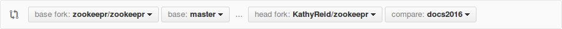

Developing ZooKeepr
===================

This section of the documentation is designed to:

* Tools - making sure you have all the development tools that you need to get started
* Environments - making sure you can create and configure your environments to begin development
* Revision control - making sure you know how to branch, commit and push changes to appropriate branches and repositories

### Tools

In order to develop on ZooKeepr, you will need the following tools and preliminary knowledge.

* [Git](http://www.github.com) - Ideally, you will have some exposure to *source control* and *revision control* using git, and using local and remote repositories in GitHub. Here are some links to get you started if you're not already comfortable in git;
  - [Pro Git book online](http://git-scm.com/book/en/v2)
  - [Listing of Git clients](http://git-scm.com/downloads/guis)
  - [Scott Chacon of GitHub provides a video introduction to Git](https://www.youtube.com/watch?v=ZDR433b0HJY)

* [Python](https://www.python.org/) - Ideally, if you are developing, you will have some exposure to the Python programming language.
  - [Pylons](http://www.pylonsproject.org/) ZooKeepr is built in Pylons. An understanding of this framework will be useful.

* [Postgres](http://www.postgresql.org/) - The ZooKeepr backend is build on the Postgres relational database.

* [Alemic](https://alembic.readthedocs.org/en/latest/) - Alembic is used for database migration activities.

* HTML and CSS - the front end of ZooKeepr is built in HTML and CSS. It is useful to have at least a basic understanding of HTML and CSS.

### Environments

Refer to the INSTALL file at the root level of the ZooKeepr repository. This file walks you through how to install a test ZooKeepr environment. 

### Revision control

1. First, you need to ensure that you have a [GitHub account](http://www.github.com)
2. Next, [fork](https://help.github.com/articles/fork-a-repo/) the [ZooKeepr Repository](https://github.com/zookeepr/zookeepr) into your own repository. You should now have a repository in your GitHub account called

```
https://github.com/your-github-username/zookeepr
```
3. Now, you need to [clone](https://help.github.com/articles/which-remote-url-should-i-use/) the repository you've just forked to your local development environment. We won't go into detail here - if you're on Linux, Mac or Windows, you will need to use the Git client or Git commands appropriate to your system.
4. Create a new [branch](http://git-scm.com/book/en/v2/Git-Branching-Basic-Branching-and-Merging) in your local repository. You will undertake development in this branch. If you're working on several new features for ZooKeepr, you may wish to have a branch for every feature. You will need to [push changes](http://git-scm.com/book/en/v2/Git-Basics-Working-with-Remotes) from your local repository (and branch) to your remote repository (the one you forked in Step 2) and branch.
5. Next, to have your changes merged with the ZooKeepr master branch, you will need to [issue a pull request](https://help.github.com/articles/using-pull-requests/) from your GitHub feature branch. We are using a fork and pull model for ZooKeepr development.
Your pull request should look something like the below, with your username and the name of the branch you are working on.



6. A ZooKeepr administrator will then inspect your pull request, and if valid, merge with the master branch. She or he may contact you to discuss the pull request if there are issues.
